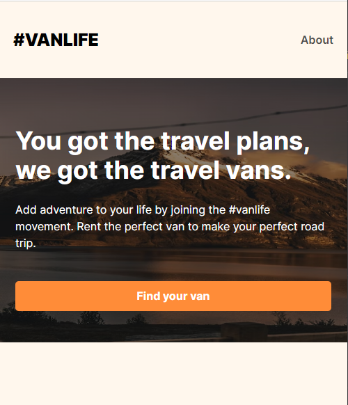

# Vans Life

_Add adventure to your life by joining the #vanlife movement. Rent the perfect van to make your perfect road trip._

### Site URL

> https://my-van-lifes-project.netlify.app/

- Warning: This is just made for mobile version, and Tablet version coming soon......

---

### _*VanLife Home Page*_

### _*VanLife about Page*_

## Adding More Features

1. #VANLIFE
2. Host
3. About
4. Vans

### 1. _#VANLIFE_

### 2. _Host_

---

# React + Vite

This template provides a minimal setup to get React working in Vite with HMR and some ESLint rules.

Currently, two official plugins are available:

- [@vitejs/plugin-react](https://github.com/vitejs/vite-plugin-react/blob/main/packages/plugin-react/README.md) uses [Babel](https://babeljs.io/) for Fast Refresh
- [@vitejs/plugin-react-swc](https://github.com/vitejs/vite-plugin-react-swc) uses [SWC](https://swc.rs/) for Fast Refresh
